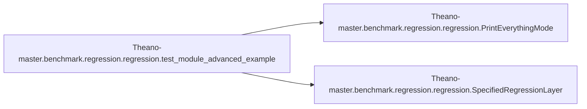

# Theano-master Benchmark Regression

[_Documentation generated by Documatic_](https://www.documatic.com)

<!---Documatic-section-Codebase Structure-start--->
## Codebase Structure

<!---Documatic-block-system_architecture-start--->
```mermaid
None
```
<!---Documatic-block-system_architecture-end--->

# #
<!---Documatic-section-Codebase Structure-end--->

<!---Documatic-section-Theano_master.benchmark.regression.regression.test_module_advanced_example-start--->
## Theano-master.benchmark.regression.regression.test_module_advanced_example

<!---Documatic-section-test_module_advanced_example-start--->


### Object Calls

* Theano-master.benchmark.regression.regression.PrintEverythingMode
* Theano-master.benchmark.regression.regression.SpecifiedRegressionLayer

<!---Documatic-block-Theano_master.benchmark.regression.regression.test_module_advanced_example-start--->
<details>
	<summary><code>Theano_master.benchmark.regression.regression.test_module_advanced_example</code> code snippet</summary>

```python
def test_module_advanced_example():
    profmode = theano.ProfileMode(optimizer='fast_run', linker=theano.gof.OpWiseCLinker())
    profmode = PrintEverythingMode(theano.gof.OpWiseCLinker(), 'fast_run')
    data_x = N.random.randn(4, 10)
    data_y = [[int(x)] for x in N.random.randn(4) > 0]
    model = SpecifiedRegressionLayer(regularize=False).make(input_size=10, target_size=1, stepsize=0.1, mode=profmode)
    for i in xrange(1000):
        (xe, gw, gb, ga) = model.update(data_x, data_y)
        if i % 100 == 0:
            print(i, xe)
            pass
    print('final weights:', model.w)
    print('final biases:', model.b)
    profmode.print_summary()
```
</details>
<!---Documatic-block-Theano_master.benchmark.regression.regression.test_module_advanced_example-end--->
<!---Documatic-section-test_module_advanced_example-end--->

# #
<!---Documatic-section-Theano_master.benchmark.regression.regression.test_module_advanced_example-end--->

[_Documentation generated by Documatic_](https://www.documatic.com)